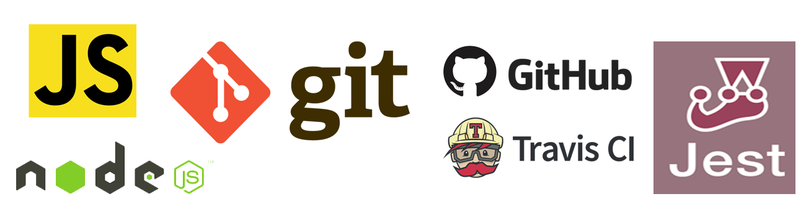

# blocktron-lib v0.0.2
[](https://nodei.co/npm/blocktron-lib/)

[](https://github.com/Blocktron-Project/blocktron-lib/blob/master/LICENSE)      [](https://snyk.io/test/github/Blocktron-Project/blocktron-lib?targetFile=package.json)  [](https://greenkeeper.io/) [](https://github.com/Blocktron-Project/blocktron-lib/issues) [](https://github.com/Blocktron-Project/blocktron-lib/network) [](https://github.com/Blocktron-Project/blocktron-lib/stargazers) [](https://twitter.com/intent/tweet?text=Wow:&url=https%3A%2F%2Fgithub.com%2FBlocktron-Project%2Fblocktron-lib) 

**blocktron-lib** module is a member of the [Blocktron Project](https://github.com/Blocktron-Project). blocktron-lib is a javascript library housing a blockchain class, and the core blockchain data structures with various blockchain methods and functionalities. This library is fully extensible to accommodate any blockchain applications. Its completely independent and follows a class constructor design pattern and is written using ES6 specifications.

**Blocktron** is a simple yet elegant and efficient blockchain framework written in **Javascript** for **Node.js** environment. Blocktron is aimed at developing generic, multipurpose blockchain platforms and softwares for various application use-cases, and also for educational and awareness purposes. blocktron-lib is completely tested using Jest framework. This library is built from the ground up using only opensource technologies.

## Getting Started
These instructions will get you a copy of the project up and running on your local machine for development and testing purposes. 

**Prerequisites**

The following programs/libraries/languages/compilers/editors/tools etc are required to use the blocktron-lib.
- Node.js >= [Node.js 4.x](https://nodejs.org/dist/latest-v4.x/)
- [git](https://git-scm.com/)
- Terminal / cmd
- Code Editor (```VSCode preferably```)

## Installation

**blocktron-lib** module has two assets in every version release builds, a compressed build and an uncompressed build.

| build | asset | size |
| --- | --- | --- |
| compressed| main.min.js | 3KiB |
| uncompressed| main.js | 14.9KiB |

by default npm module is set to choose the compressed build.

**NPM**

You can install **blocktron-lib** from npm using:
```sh
npm install blocktron-lib --save
```
**GitHub**

You can download a zip of the project repo or clone the repo from your terminal using the command:
```sh
git clone https://github.com/Blocktron-Project/blocktron-lib.git
```
**Sample usage**

```js
//In your app.js
const Blocktron = require('blocktron-lib');
const blockchain = new Blocktron;

console.log(blockchain);
```
then run your app.js by
```sh
node app.js
```
Your blockchain with the default genesis block will be displayed as:
```sh
Blocktron {
	chain: [{
		index: 1,
		timeStamp: 1529827768993,
		transactions: [],
		nonce: 1,
		hash: '0',
		previousHash: '0'
	}],
	pendingTransactions: []
}
```

## Dependency

The blocktron-lib library is dependent only on the ***`sha256`*** npm module to run on production. Its a JavaScript component to compute the `SHA256` of strings or bytes.

For a development setup this library depends on the following npm modules:
- [**babel-core**](https://www.npmjs.com/package/babel-core)
    The babel compiler core
- [**babel-eslint**](https://www.npmjs.com/package/babel-eslint)
    babel-eslint allows you to lint ALL valid Babel code with the fantastic ESLint.
- [**babel-loader**](https://www.npmjs.com/package/babel-loader)
    This package allows transpiling JavaScript files using Babel and webpack.
- [**babel-preset-stage-0**](https://www.npmjs.com/package/babel-preset-stage-0)
    Babel preset for stage 0 plugins.
- [**babel-preset-es2015**](https://www.npmjs.com/package/babel-preset-es2015)
    Babel preset for all es2015 plugins.
- [**eslint**](https://www.npmjs.com/package/eslint)
    ESLint is a tool for identifying and reporting on patterns found in ECMAScript/JavaScript code.
- [**jest**](https://www.npmjs.com/package/jest)
    A javascript test framework developed by Facebook.
- [**prettier**](https://www.npmjs.com/package/prettier)
    Prettier is an opinionated code formatter. It enforces a consistent style by parsing your code and re-printing it with its own rules that take the maximum line length into account, wrapping code when necessary.
- [**prettier-webpack-plugin**](https://www.npmjs.com/package/prettier-webpack-plugin)
    Automatically process your source files with Prettier when bundling via Webpack.
- [**webpack**](https://www.npmjs.com/package/webpack)
    webpack is a module bundler. Its main purpose is to bundle JavaScript files for usage in a browser, yet it is also capable of transforming, bundling, or packaging just about any resource or asset.
- [**webpack-cli**](https://www.npmjs.com/package/webpack-cli)
    Webpack CLI encapsulates all code related to CLI handling. It captures options and sends them to webpack compiler. You can also find functionality for initializing a project and migrating between versions.

## Changelog

**v 0.0.2**
- Documentation updates
- Greenkeeper enabled
- Snyk Vulnerabilities check enabled
- Code quality coverage using codefactor

**v 0.0.1**
- Complete blockchain implementation in javascript
- Updated documentations
- Code optimizations
- Continuous integration using Travis-CI & CircleCI
- Complete code test coverage
- Unit tests added using Jest

## API Documentation
The various apis provided by the blocktron-lib are described below:

#### Start a blockchain
You can start the blockchain by importing the blocktron-lib to your app using:
```js
const Blocktron = require('blocktron-lib');
const blockchain = new Blocktron;

//then simply console logging will give you the blockchain in its initial form
console.log(blockchain);
```
which will result in the following output to the terminal
```sh
Blocktron {
	chain: [{
		index: 1,
		timeStamp: 1529827768993,
		transactions: [],
		nonce: 1,
		hash: '0',
		previousHash: '0'
	}],
	pendingTransactions: []
}
```
You can see that the blockchain object already has a block with some data in it. This block is the default block of every blockchain. It is called as the **Genesis Block**. Whenever a new blockchain is initialized, it defaults with a genesis block and further blocks are linked from the genesis block.

#### Create a new block
A blockchain method to create a new block
```js
blockchain.createNewBlock('<nonce>', '<previousHash>', '<hash>');
```
##### Parameters
| Parameter | Type | Description | Optional | 
| --- | --- | --- | --- |
| **nonce** | *Number* | The nonce number obtained from proof-of-work method | No | 
| **previousHash** | *String* | The hash of the previous block | No |
| **hash** | *String* | The hash generated from this block's data | No |

result:
```sh
Blocktron {
	chain: [{
			index: 1,
			timeStamp: 1529852953815,
			transactions: [],
			nonce: 1,
			hash: '0',
			previousHash: '0'
		},
		{
			index: 2,
			timeStamp: 1529852953815,
			transactions: [],
			nonce: 2389,
			hash: '23huih2342jh34j',
			previousHash: 'a87sdfs8df8ds89f'
		}
	],
	pendingTransactions: []
}
```
> **Note:** The genesis block is created using this method internally.

#### Get last block
A blockchain method to get the last block on the chain
```js
blockchain.getLastBlock()
```
> **Note:** This method does not accept any parameters, it simply returns the block object from the data structure at the penultimate position

result:
```sh
{
	index: 2,
	timeStamp: 1529853936748,
	transactions: [],
	nonce: 2389,
	hash: '23huih2342jh34j',
	previousHash: 'a87sdfs8df8ds89f'
}
```
#### Create a new transaction
A blockchain method to create a new transaction to be recorded on to the chain.
```js
blockchain.createNewTransaction('<amount>', '<sender>', '<receiver>')
```
##### Parameters
| Parameter | Type | Description | Optional | 
| --- | --- | --- | --- |
| **amount** | *Number* | The amount/value to be recorded | No|
| **sender** | *String* | The adress of the sender | No |
| **receiver** | *String* | The address of the receiver | No |

result:
```sh
Blocktron {
	chain: [{
			index: 1,
			timeStamp: 1529854616451,
			transactions: [],
			nonce: 1,
			hash: '0',
			previousHash: '0'
		},
		{
			index: 2,
			timeStamp: 1529854616451,
			transactions: [],
			nonce: 2389,
			hash: '23huih2342jh34j',
			previousHash: 'a87sdfs8df8ds89f'
		}
	],
	pendingTransactions: [{
		amount: 100,
		sender: 'ROSS2IU3Y42U3',
		reciever: 'RACHELJ234J234KJ20'
	}]
}
```
> **Note:** The new transaction is always added to the pending transactions array, for it to be mined later.

#### Generate hash of a block
A helper method to generate a hash string out of a blocks data
```js
blockchain.hashBlock('<previousBlockHash>', '<currentBlockData>', '<nonce>')
```
##### Parameters
| Parameter | Type | Description | Optional | 
| --- | --- | --- | --- |
| **previousBlockHash** | *String* | The hash of the previous block | No |
| **currentBlockData** | *Object* | The current block's data | No |
| **nonce** | *Number* | The nonce of the block | Yes |

result:
```sh
445101fbd33c3b30f00d143dba65cfe219bace079d1d06b4b7b28922d7a611d6
```

#### Proof of work
An opinionated, standardized, and universally approved blockchain method to validate random blocks added to the blockchain.
The Proof of work algorithm implemented in this library is as follows:
1. Repeatedly hash the block data until it reaches the format: '0000<HF98WDYS89DCSD>'.
2. Uses current block data as well as previous block hash.
3. Continuously change the nonce until the correct hash is obtained.
4. Return the nonce value which generates the correct hash.
The proofOfWork algorithm runs to a complexity of **`O(n)`**.

**Algorithm:**
```{r, tidy=FALSE, eval=FALSE, highlight=TRUE }
ProofOfWork()
Input <previousBlockHash>, <currentBlockData>
Output <nonce>

START
SET nonce = 0
GET hashString = hashBlock(previousBlockHash, currentBlockData, nonce)
	DO nonce++
		hashString = hashBlock(previousBlockHash, currentBlockData, nonce)

	WHILE hashString.substring(0, 4) !== '0000'
END
```

```js
blockchain.proofOfWork('<previousBlockHash>', '<currentBlockData>');
```
##### Parameters
| Parameter | Type | Description | Optional | 
| --- | --- | --- | --- |
| **previousBlockHash** | *String* | The hash of the previous block | No |
| **currentBlockData** | *Object* | The current block's data | No |

result:
```js
1441212 //some large integer
```
The result of this proof of work method is a number which is the nonce which generates the correct hash of the format `'0000<hash>'`. This nonce when used to generate a hash will generate the correctly formated hash, thus making it the proof we need. This is secure because, the algorithm has to run `1441212` times to generate the correct hash, in this case. This is a time consuming and resource intensive process, Thus when someone tries to tamper the integrity of a blockchain, they have to rebuild the entire blockchain using this proof of work algorithm to generate correct hash and nonce combination for the entire blockchain, which is impossible.

Further examples and documentations will be updated soon, or you can run the test specs from the tests folder.

## Continuous Integration (CI)
Continuous Integration services monitor repositories for changes, then automatically run unit tests on your behalf, typically in a containerized environment. To test this setup works in a continuous integration environment, an integration was done with [Travis CI](https://travis-ci.org/) & [CircleCI](https://circleci.com/). According to the [Travis Node.js Documentation](http://docs.travis-ci.com/user/languages/javascript-with-nodejs/), Travis automatically runs `npm install` and `npm test`. The only additional thing I had to add to the Travis configuration was to run `npm run build` before running the tests. The working Travis config looks like this:

```yml
language: node_js

node_js:
  - stable

install:
  - npm install

script:
  - npm run build
  - npm test
```
Here's the [Travis build page for this project](https://travis-ci.org/Blocktron-Project/blocktron-lib), which shows the tests passing.

CircleCI is similar to Travis-CI, but is more extensible and has much more control over the build process. The CircleCI config looks like this:

```yml
# Javascript Node CircleCI 2.0 configuration file
#
# Check https://circleci.com/docs/2.0/language-javascript/ for more details
#
version: 2
jobs:
  build:
    docker:
      # specify the version you desire here
      - image: circleci/node:7.10
      
      # Specify service dependencies here if necessary
      # CircleCI maintains a library of pre-built images
      # documented at https://circleci.com/docs/2.0/circleci-images/
      # - image: circleci/mongo:3.4.4

    working_directory: ~/repo

    steps:
      - checkout

      # Download and cache dependencies
      - restore_cache:
          keys:
          - v1-dependencies-{{ checksum "package.json" }}
          # fallback to using the latest cache if no exact match is found
          - v1-dependencies-

      - run: npm install

      - save_cache:
          paths:
            - node_modules
          key: v1-dependencies-{{ checksum "package.json" }}
        
      # run tests!
      - run: npm run build
      - run: npm test
```

## Tests
This project uses Jest framework for unit testing. All unit tests are available in the test folder. Tests can be run by the command:
```sh
npm run test
```
## Built with
This project is built with the following technology stack:
- **JavaScript**
- **Node.js**
- **Git**
- **GitHub**
- **Travis-CI**
- **Jest**



## Contributing
Please read [CONTRIBUTING.md](https://github.com/Blocktron-Project/blocktron-lib/blob/master/CONTRIBUTING.md) for details on contributing to the project and [CODE_OF_CONDUCT.md](https://github.com/Blocktron-Project/blocktron-lib/blob/master/CODE_OF_CONDUCT.md) for the process for submitting pull requests to us.

## Versioning
We use [SemVer](https://semver.org/) for versioning. For the versions available, see the [tags](https://github.com/Blocktron-Project/blocktron-lib/tags) on this repository.

## Authors
* [Sandeep Vattapparambil](https://github.com/SandeepVattapparambil) - Founder, Lead Developer & Maintainer

See also the list of [contributors](https://github.com/Blocktron-Project/blocktron-lib/blob/master/AUTHORS.md) who participates in this project.

## License
The MIT License

Copyright (c) 2018- Sandeep Vattapparambil, http://www.sandeepv.in

Permission is hereby granted, free of charge, to any person obtaining a copy of this software and associated documentation files (the "Software"), to deal in the Software without restriction, including without limitation the rights to use, copy, modify, merge, publish, distribute, sublicense, and/or sell copies of the Software, and to permit persons to whom the Software is furnished to do so, subject to the following conditions:

The above copyright notice and this permission notice shall be included in all copies or substantial portions of the Software.

THE SOFTWARE IS PROVIDED "AS IS", WITHOUT WARRANTY OF ANY KIND, EXPRESS OR IMPLIED, INCLUDING BUT NOT LIMITED TO THE WARRANTIES OF MERCHANTABILITY, FITNESS FOR A PARTICULAR PURPOSE AND NONINFRINGEMENT. IN NO EVENT SHALL THE AUTHORS OR COPYRIGHT HOLDERS BE LIABLE FOR ANY CLAIM, DAMAGES OR OTHER LIABILITY, WHETHER IN AN ACTION OF CONTRACT, TORT OR OTHERWISE, ARISING FROM, OUT OF OR IN CONNECTION WITH THE SOFTWARE OR THE USE OR OTHER DEALINGS IN THE SOFTWARE.

## Acknowledgements
Thanks to [Eric Traub](https://www.linkedin.com/in/eric-traub-76b38953/) for publishing a wonderful course on Blockchains.

Made with ❤️ by [Sandeep Vattapparambil](https://github.com/SandeepVattapparambil).
